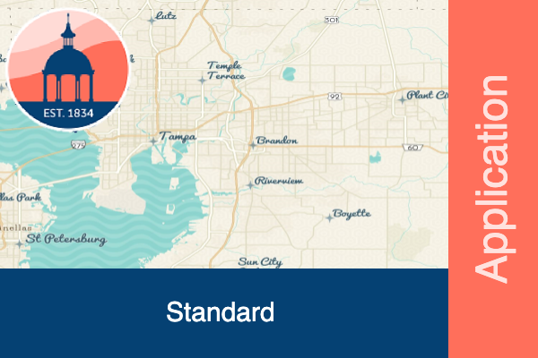
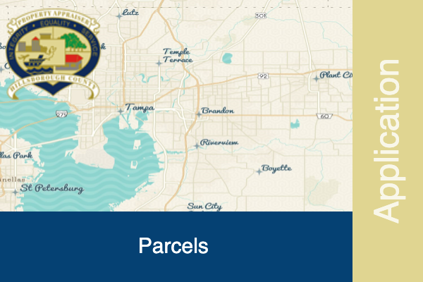

# ArcGIS Thumbnail Builder

The ArcGIS Thumbnail Builder is an intuitive web application for constructing
thumbnails for ArcGIS Online items, utilizing HTML5 canvas.

## Example Output Thumbnails

## Getting Started

There is no special setup required to run this application.  Just place the files on
a web server, locally or in production.  No other resources are required.  

## License

GNU General Public License v3.0
